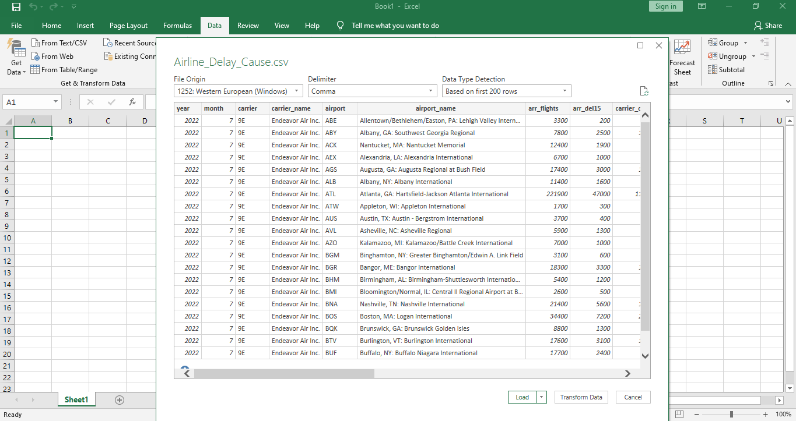
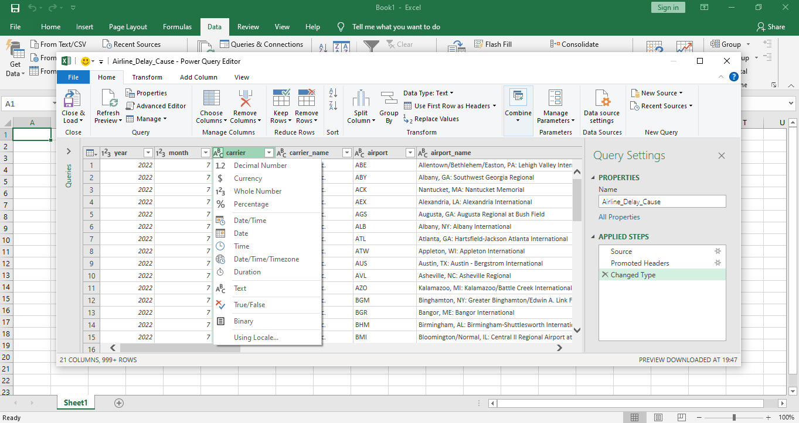
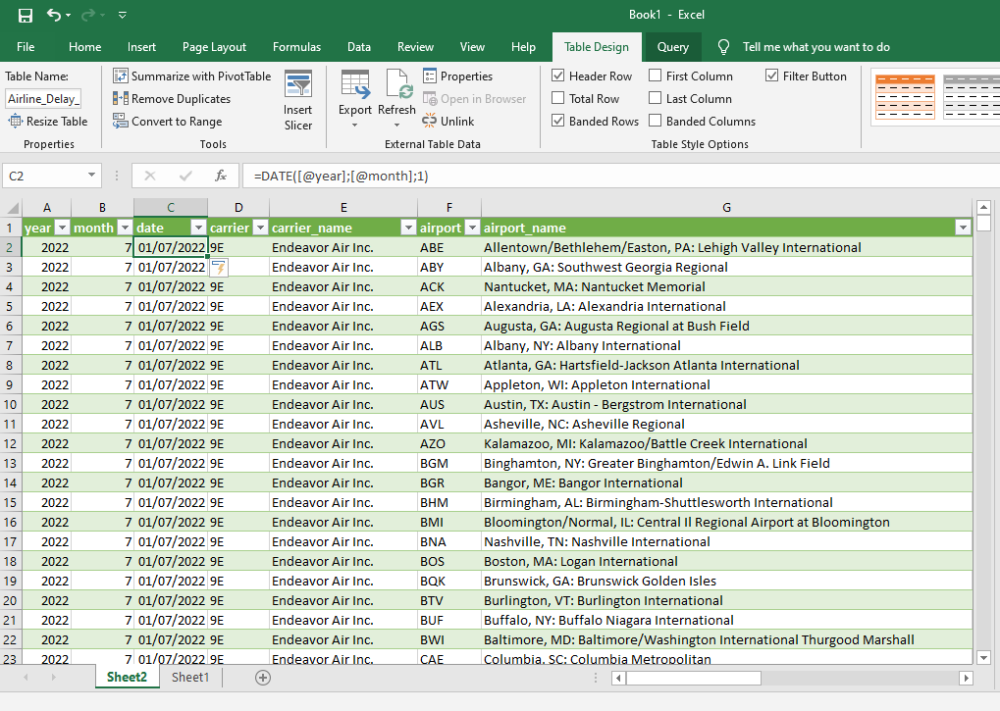
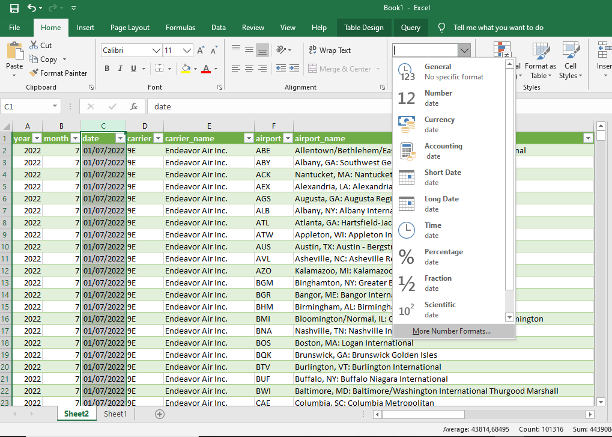
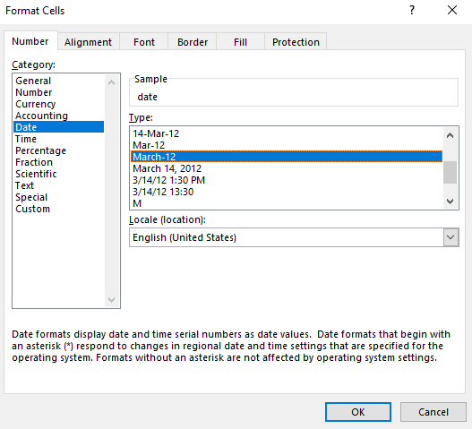
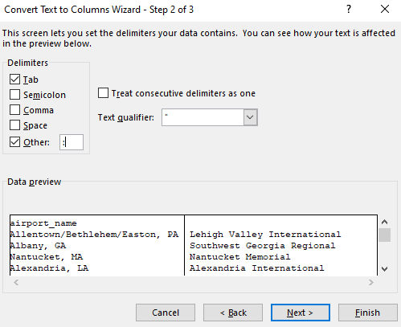
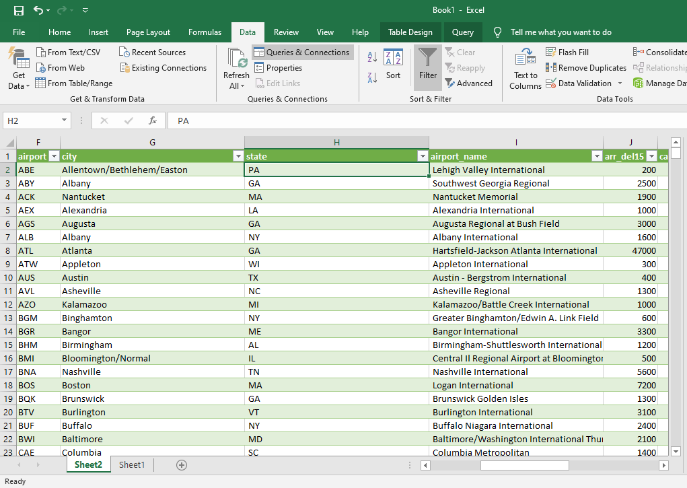
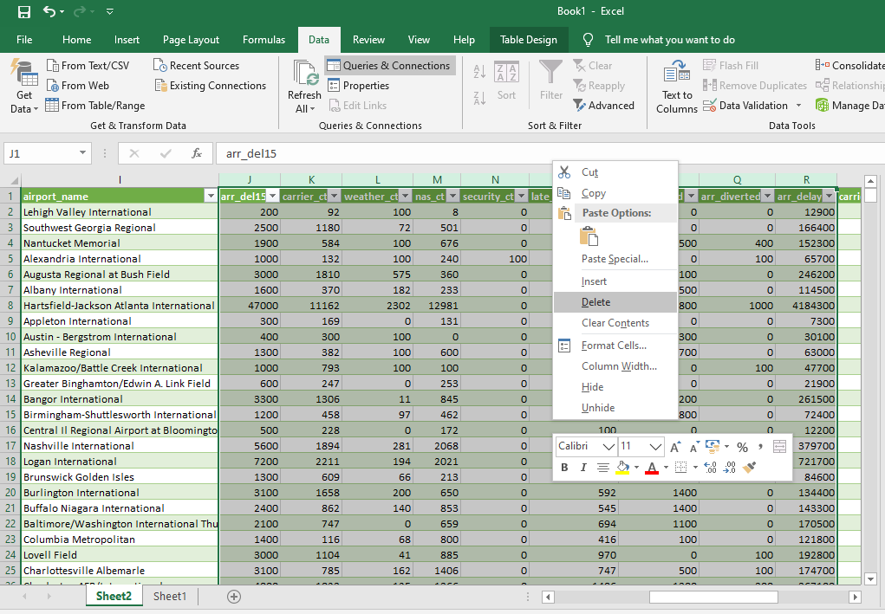
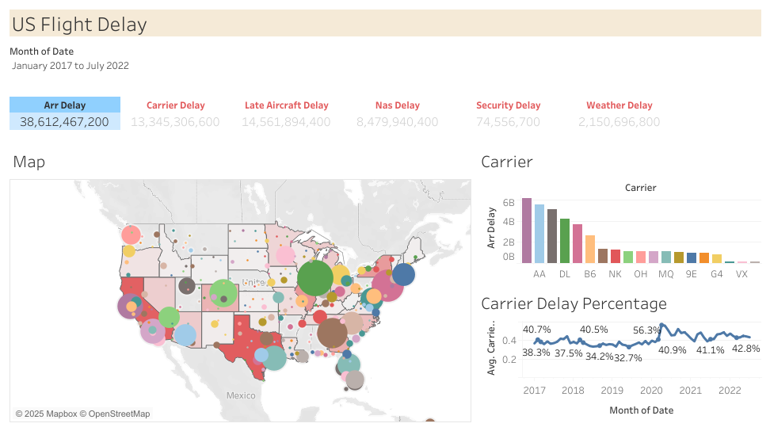

# 🧹 Data Cleaning Project (Excel)

## 📌 Project Overview
Project ini bertujuan untuk membersihkan dataset mentah agar siap digunakan untuk analisis.  
Proses cleaning dilakukan menggunakan **Microsoft Excel**.

Dataset yang digunakan:
1. Flight Delay from January 2017 - July 2022
- Sumber: [https://www.kaggle.com/datasets/jawadkhattak/us-flight-delay-from-january-2017-july-2022]
- Ukuran data: [101.315 baris & 21 kolom] 
- Format: [CSV]

## 🎯 Objectives
1. Menghapus data duplikat
2. Menangani missing values
3. Standarisasi format kolom (tanggal, angka, teks)
4. Menghapus data yang tidak relevan
5. Mengoreksi inkonsistensi data

---

## 🛠 Tools & Technologies
- **Excel** → Get & Transform Data (Power Query), Change Data Type, Split Column by Delimiter, Replace Values, Remove Columns / Rows. 

---

## 📂 Data Cleaning Steps

### 1️⃣ Excel
File Excel: [`Data-Cleaning-Project/Airline_Delay_Cause.csv`](Data-Cleaning-Project/Airline_Delay_Cause.csv)  
Langkah-langkah:
1. **Import file csv ke microsoft excel. Kemudian klik 'Transform data'.**

2. **Cek format data untuk mengetahui apakah sudah sesuai atau tidak. Kemudian close dan load data.**

3. **Menggabungkan kolom 'year' dan kolom 'month' menggunakan rumus '=DATE(year; month; day)' dan memisalkan semua tanggal sama, yaitu '=DATE(year; month; 1)' dan menjadikan kolom baru dengan nama 'date'.**

4. **Ubah format tanggal tersebut dengan klik kolom 'date' → klik 'Home' → pada menu 'Number' pilih 'more number formats' dan klik seperti pada gambar.**

5. **Karena kolom 'airport_name' memiliki dua informasi yaitu nama bandara dan nama kota, pisahkan kolom tersebut menjadi dua bagian dengan mengklik kolom 'G' → klik 'Data' → klik 'Text to Columns' dan klik seperti pada gambar dengan memilih (:) sebagai tanda pemisah. Klik 'Finish' dan ubah nama kolom.**

6. **Lakukan hal yang sama seperti langkah 5 untuk memisahkan informasi nama kota dan provinsi pada kolom 'city' dengan memilih (,) sebagai tanda pemisah.**

7. **Standarisasi format teks menggunakan rumus '=TRIM(text)'.**

8. **Hapus kolom yang tidak diperlukan.**

---
## Data Setelah Data Cleaning
 [`Data-Cleaning-Project/Excel/Data_Cleaning_Airline_delay_cause.xlsx`](Data-Cleaning-Project/Excel/Data_Cleaning_Airline_delay_cause.xlsx)

---
Setelah proses data cleaning selesai di Excel, dataset yang sudah bersih di-export ke Tableau untuk tahap data visualization. Di Tableau, data diolah menjadi dashboard interaktif yang menampilkan metrik utama dan visualisasi yang memudahkan analisis serta pengambilan keputusan.

Link Tableau Public: [https://public.tableau.com/views/USFlightDelay_17545342874120/Dashboard1?:language=en-US&publish=yes&:sid=&:redirect=auth&:display_count=n&:origin=viz_share_link]
