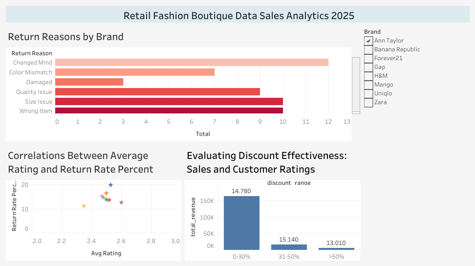
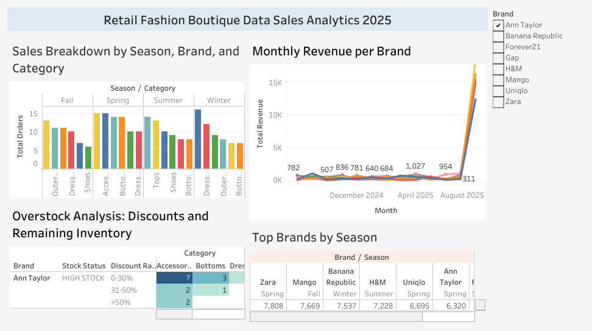

# Fashion Boutique Sales Analysis
**Tools:** MySQL, Tableau  
**Skills:** Aggregation, Dashboarding  

## Tujuan
1. Mengetahui alasan pengembalian produk paling banyak untuk setiap brand
2. Analisis pola penjualan berdasarkan musim, brand, dan kategori
3. Pemantauan perkembangan pendapatan bulanan per brand
4. Evaluasi overstock dan sisa persediaan
5. Korelasi rating pelanggan dengan tingkat pengembalian produk
6. Evaluasi efektivitas tingkat diskon terhadap penjualan dan rating 

## Dataset
Sumber: Kaggle - [Fashion Boutique Dataset](https://www.kaggle.com/datasets/pratyushpuri/retail-fashion-boutique-data-sales-analytics-2025/data)  

## Langkah Pengerjaan
1. Import data ke MySQL
2.  Query untuk:
   - Menampilkan jumlah alasan pengembalian per brand dan ranking-nya.
   - Membuat tabel baru berisi alasan pengembalian terbanyak untuk tiap brand.
   - Menghitung rata-rata rating, total order, total return, dan return rate per brand.
   - Menampilkan total order per kategori, brand, dan musim.
   - Menghitung total revenue per brand dan musim.
   - Menampilkan musim dengan revenue tertinggi untuk tiap brand.
   - Mengelompokkan diskon dalam range, menghitung total order, total revenue, harga jual rata-rata, dan return rate untuk tiap range diskon.
   - Menampilkan total order dan revenue bulanan per brand (tanpa return).
   - Menampilkan stok saat ini dan total order per brand dan kategori.
   - Menandai status stok produk (low, normal, high) dan kategori diskon
4. Export hasil query ke Tableau
5. Membuat dashboard interaktif

## Hasil

[Link ke Tableau Public](https://public.tableau.com/views/project1_17556127461290/Dashboard1?:language=en-US&publish=yes&:sid=&:redirect=auth&:display_count=n&:origin=viz_share_link)

[Link ke Tableau Public](https://public.tableau.com/views/project1_17556127461290/Dashboard2?:language=en-US&:sid=&:redirect=auth&:display_count=n&:origin=viz_share_link)

## Insight
- Brand dengan return rate tinggi biasanya punya rata-rata rating lebih rendah.
- Ada brand yang return rate nya tinggi meski rating lumayan: kemungkinan masalah di ukuran, warna, atau harapan konsumen yang tidak sesuai.
- Range diskon tertentu memiliki return rate tinggi: diskon terlalu besar belum tentu paling efektif.
- Beberapa brand atau kategori memiliki permintaan tinggi di musim tertentu: peluang untuk stok lebih banyak di periode tersebut.
- Agustus adalah bulan dengan puncak penjualan tertinggi untuk setiap brand
- Beberapa kategori dari suatu brand memiliki stok yang tinggi dengan range diskon rendah: naikkan range diskon untuk kategori tersebut untuk menghindari overstock
