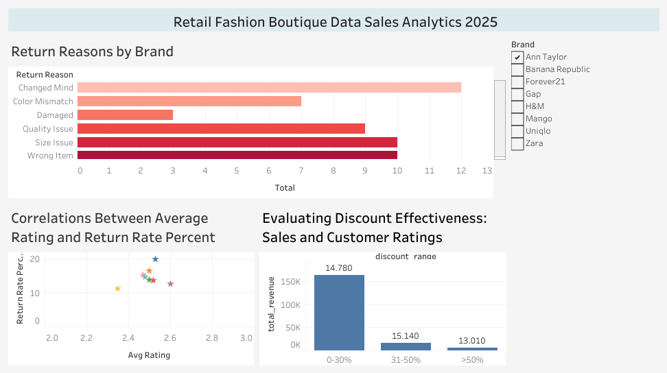
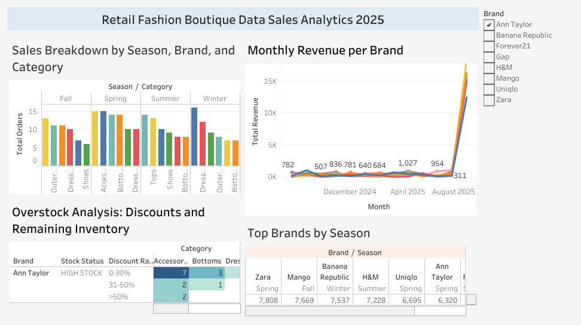

# Fashion Boutique Sales Analysis
**Tools:** MySQL, Tableau  
**Skills:** Aggregation, Dashboarding  

## Tujuan
Menganalisis data penjualan untuk menemukan tren musiman dan produk terlaris.

## Dataset
Sumber: Kaggle - [Fashion Boutique Dataset](https://www.kaggle.com/datasets/pratyushpuri/retail-fashion-boutique-data-sales-analytics-2025/data)  

## Langkah Pengerjaan
1. Import data ke MySQL
2. Query untuk:
   - Total penjualan per bulan
   - Produk dengan penjualan tertinggi
4. Export hasil query ke Tableau
5. Membuat dashboard interaktif

## Hasil

[Link ke Tableau Public](https://public.tableau.com/views/project1_17556127461290/Dashboard1?:language=en-US&publish=yes&:sid=&:redirect=auth&:display_count=n&:origin=viz_share_link)

[Link ke Tableau Public](https://public.tableau.com/views/project1_17556127461290/Dashboard2?:language=en-US&:sid=&:redirect=auth&:display_count=n&:origin=viz_share_link)

## Insight
- Agustus = penjualan tertinggi  
