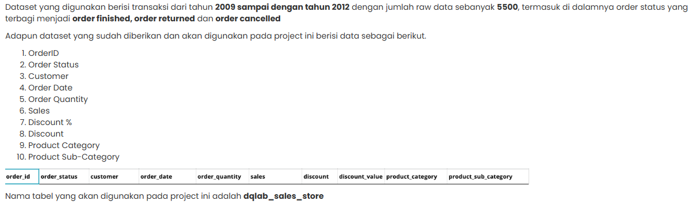

# 📊 Project Data Analysis for Retail: Sales Performance Report

## Dataset Brief


## 🎯 Tugas
Dari data yang sudah diberikan, dari pihak manajemen DQLab store ingin mengetahui:

1A. Overall perofrmance DQLab Store dari tahun 2009 - 2012 untuk jumlah order dan total sales order finished
1B. Overall performance DQLab by subcategory product yang akan dibandingkan antara tahun 2011 dan tahun 2012

2A. Efektifitas dan efisiensi promosi yang dilakukan selama ini, dengan menghitung burn rate dari promosi yang dilakukan overall berdasarkan tahun
2B. Efektifitas dan efisiensi promosi yang dilakukan selama ini, dengan menghitung burn rate dari promosi yang dilakukan overall berdasarkan sub-category

 Setelah melihat hasil analisa di Sub Bab 1 dan 2, selanjutnya dilakukan analisa terhadap customer DQLab. Analisa dari sisi customer dengan menggunakan metrics:

3A. Analisa terhadap customer setiap tahunnya

## 1A. Overall performance by year
1. Memilih data dari tabel tersebut yang hanya mencakup tahun 2009 sampai 2012 dengan menggunakan klausa WHERE untuk membatasi tahun yang akan diambil.
2. Menghitung total penjualan dan jumlah order. Untuk total penjualan, gunakan fungsi agregat SUM yang akan menjumlahkan semua nilai penjualan untuk setiap tahun. Sedangkan untuk jumlah order, gunakan COUNT untuk menghitung berapa banyak order yang ada di setiap tahun.
3. Kelompokkan hasilnya berdasarkan tahun menggunakan klausa GROUP BY supaya mendapatkan total penjualan dan jumlah order untuk setiap tahun secara terpisah.
   ```sql
   SELECT
    RIGHT(YEAR(order_date), 4) AS years,
    SUM(sales) AS sales,
    COUNT(order_id) AS number_of_order
   FROM dqlab_sales_store
   WHERE YEAR(order_date) BETWEEN 2009 AND 2012 AND order_status='order finished'
   GROUP BY RIGHT(YEAR(order_date), 4)
   ORDER BY years;
   ```
   ```sql
   +-------+------------+-----------------+
   | years | sales      | number_of_order |
   +-------+------------+-----------------+
   | 2009  | 4613872681 |            1244 |
   | 2010  | 4059100607 |            1248 |
   | 2011  | 4112036186 |            1178 |
   | 2012  | 4482983158 |            1254 |
   +-------+------------+-----------------+
   ```
  
## 1B. Overall performance by product sub category
1. Memilih kolom yang relevan, yaitu tahun penjualan, sub kategori produk, dan total penjualannya.
2. Memfilter data supaya hanya mengambil penjualan dari tahun 2011 dan 2012 saja dengan menggunakan klausa WHERE untuk menentukan tahun yang diinginkan.
3. Kelompokkan data berdasarkan sub kategori produk dengan menggunakan fungsi agregasi untuk menjumlahkan total penjualan di setiap kelompok.
4. Urutkan hasilnya berdasarkan tahun dan sub kategori produk.
   ```sql
   SELECT
    YEAR(order_date) AS years,          -- Ambil tahun dari order_date
    product_sub_category,               -- Sub kategori produk
    SUM(sales) AS sales                 -- Total penjualan per sub kategori
   FROM dqlab_sales_store
   WHERE YEAR(order_date) IN (2011, 2012) AND order_status='order finished'  
   GROUP BY years, product_sub_category
   ORDER BY years, sales DESC;             -- Urut tahun, lalu sales terbesar dulu
   ```
   ```sql
   +-------+--------------------------------+-----------+
     | years | product_sub_category           | sales     |
     +-------+--------------------------------+-----------+
     |  2011 | Chairs & Chairmats             | 622962720 |
     |  2011 | Office Machines                | 545856280 |
     |  2011 | Tables                         | 505875008 |
     |  2011 | Copiers and Fax                | 404074080 |
     |  2011 | Telephones and Communication   | 392194658 |
     |  2011 | Binders and Binder Accessories | 298023200 |
     |  2011 | Storage & Organization         | 285991820 |
     |  2011 | Appliances                     | 272630020 |
     |  2011 | Computer Peripherals           | 232677960 |
     |  2011 | Bookcases                      | 169304620 |
     |  2011 | Office Furnishings             | 160471500 |
     |  2011 | Paper                          | 111080380 |
     |  2011 | Pens & Art Supplies            |  43093800 |
     |  2011 | Envelopes                      |  36463900 |
     |  2011 | Labels                         |  15607780 |
     |  2011 | Scissors, Rulers and Trimmers  |  12638340 |
     |  2011 | Rubber Bands                   |   3090120 |
     |  2012 | Office Machines                | 811427140 |
     |  2012 | Chairs & Chairmats             | 654168740 |
     |  2012 | Telephones and Communication   | 422287514 |
     |  2012 | Tables                         | 388993784 |
     |  2012 | Binders and Binder Accessories | 363879200 |
     |  2012 | Storage & Organization         | 356714140 |
     |  2012 | Computer Peripherals           | 308014340 |
     |  2012 | Copiers and Fax                | 292489800 |
     |  2012 | Appliances                     | 266131100 |
     |  2012 | Office Furnishings             | 178927480 |
     |  2012 | Bookcases                      | 159984680 |
     |  2012 | Paper                          | 126896160 |
     |  2012 | Envelopes                      |  58629280 |
     |  2012 | Pens & Art Supplies            |  43818480 |
     |  2012 | Scissors, Rulers and Trimmers  |  36776400 |
     |  2012 | Labels                         |  10007040 |
     |  2012 | Rubber Bands                   |   3837880 |
     +-------+--------------------------------+-----------+
   ```
## 2A. Promotion effectiveness and efficiency by years
1. Menggunakan `WITH` untuk membuat sebuah tabel sementara yang disebut `sales_summary` dengan memilih kolom tahun dari `order_date` dengan fungsi `YEAR()`, menghitung total penjualan (`SUM(sales)`) serta total nilai diskon (`SUM(discount_value)`) untuk setiap tahun.
2. Memfilter data di mana status pesanan adalah 'order finished', yang berarti hanya pesanan yang sudah selesai yang dihitung.
3. Hasilnya dikelompokkan berdasarkan tahun dengan menggunakan klausa GROUP BY.
4. Memilih tahun, total penjualan, total nilai promosi, dan menghitung persentase burn rate dari data tabel `sales_summary` yang dibulatkan hingga dua angka desimal dengan fungsi ROUND.
   Formula untuk burn rate : (total discount / total sales) * 100
5. Urutkan berdasarkan tahun dengan klausa ORDER BY.
   ```sql
   -- Derived Table untuk menghitung total sales dan total promotion per tahun
  WITH sales_summary AS (
      SELECT 
          YEAR(order_date) AS years,
          SUM(sales) AS sales,
          SUM(discount_value) AS promotion_value
      FROM dqlab_sales_store
    	WHERE order_status='order finished'
      GROUP BY YEAR(order_date)
  )
  
  -- Hitung burn rate berdasarkan derived table
  SELECT 
      years,
      sales,
      promotion_value,
      ROUND((promotion_value / sales) * 100, 2) AS burn_rate_percentage
  FROM sales_summary
  ORDER BY years;

+-------+------------+-----------------+----------------------+
| years | sales      | promotion_value | burn_rate_percentage |
+-------+------------+-----------------+----------------------+
| 2009  | 4613872681 |       214330327 |                 4.65 |
| 2010  | 4059100607 |       197506939 |                 4.87 |
| 2011  | 4112036186 |       214611556 |                 5.22 |
| 2012  | 4482983158 |       225867642 |                 5.04 |
+-------+------------+-----------------+----------------------+

## 2B. Promotion effectiveness and efficiency by product sub category
1. Menggunakan Common Table Expression (CTE) `WITH`  untuk membuat sebuah tabel sementara yang disebut `sales_summary` dengan memilih beberapa kolom, yaitu tahun dari tanggal pesanan (order_date) dengan fungsi YEAR, subkategori produk (product_sub_category), kategori produk (product_category), total penjualan (sales) dengan menggunakan fungsi SUM dan total nilai diskon (promotion_value) juga dengan fungsi SUM.
2. Memfilter data untuk tahun 2012 dan status pesanan yang sudah selesai (order_status='order finished').
3. Kelompokkan data berdasarkan tahun, subkategori produk, dan kategori produk dengan menggunakan klausa GROUP BY.
4. Memilih kolom-kolom yang sama seperti sebelumnya, ditambah satu kolom baru persentase burn rate, yang dihitung dengan rumus (promotion_value / sales) * 100 dan bulatkan hingga dua angka desimal dengan fungsi ROUND. Aambil data dari CTE "sales_summary" yang sudah kita buat sebelumnya.
5. Urutkan hasilnya berdasarkan total penjualan (sales) secara menurun (DESC).
   ```sql
   WITH sales_summary AS (
    SELECT
        YEAR(order_date) AS years,
        product_sub_category,
        product_category,
        SUM(sales) AS sales,
        SUM(discount_value) AS promotion_value
    FROM dqlab_sales_store
    WHERE YEAR(order_date) = 2012 AND order_status='order finished'
    GROUP BY YEAR(order_date), product_sub_category, product_category
  )
  
  SELECT
      years,
      product_sub_category,
      product_category,
      sales,
      promotion_value,
      ROUND((promotion_value / sales) * 100, 2) AS burn_rate_percentage
  FROM sales_summary
  ORDER BY sales DESC;  -- bisa diurutkan berdasarkan sales atau burn rate
   
+-------+--------------------------------+------------------+-----------+-----------------+----------------------+
| years | product_sub_category           | product_category | sales     | promotion_value | burn_rate_percentage |
+-------+--------------------------------+------------------+-----------+-----------------+----------------------+
|  2012 | Office Machines                | Technology       | 811427140 |        46616695 |                 5.75 |
|  2012 | Chairs & Chairmats             | Furniture        | 654168740 |        26623882 |                 4.07 |
|  2012 | Telephones and Communication   | Technology       | 422287514 |        18800188 |                 4.45 |
|  2012 | Tables                         | Furniture        | 388993784 |        16348689 |                  4.2 |
|  2012 | Binders and Binder Accessories | Office Supplies  | 363879200 |        22338980 |                 6.14 |
|  2012 | Storage & Organization         | Office Supplies  | 356714140 |        18802166 |                 5.27 |
|  2012 | Computer Peripherals           | Technology       | 308014340 |        15333293 |                 4.98 |
|  2012 | Copiers and Fax                | Technology       | 292489800 |        14530870 |                 4.97 |
|  2012 | Appliances                     | Office Supplies  | 266131100 |        14393300 |                 5.41 |
|  2012 | Office Furnishings             | Furniture        | 178927480 |         8233849 |                  4.6 |
|  2012 | Bookcases                      | Furniture        | 159984680 |        10024365 |                 6.27 |
|  2012 | Paper                          | Office Supplies  | 126896160 |         6224694 |                 4.91 |
|  2012 | Envelopes                      | Office Supplies  |  58629280 |         2334321 |                 3.98 |
|  2012 | Pens & Art Supplies            | Office Supplies  |  43818480 |         2343501 |                 5.35 |
|  2012 | Scissors, Rulers and Trimmers  | Office Supplies  |  36776400 |         2349280 |                 6.39 |
|  2012 | Labels                         | Office Supplies  |  10007040 |          452245 |                 4.52 |
|  2012 | Rubber Bands                   | Office Supplies  |   3837880 |          117324 |                 3.06 |
+-------+--------------------------------+------------------+-----------+-----------------+----------------------+

## 3A. Customers transactions per year
1. Memilih dua kolom untuk ditampilkan dalam hasil query yaitu kolom tahun dengan fungsi YEAR() dan menghitung jumlah pelanggan yang unik (tidak duplikat) dengan fungsi COUNT(DISTINCT...)
2. Memfilter data dari tahun 2009 hingga 2012 dan data di mana status pesanan adalah 'order finished' menggunakan klausa WHERE.
3. Kelompokkan hasil berdasarkan tahun yang sudah diambil sebelumnya dengan menggunakan klausa GROUP BY.
4. Urutkan hasil berdasarkan kolom "years" sehingga hasilnya akan ditampilkan dari tahun terkecil ke tahun terbesar.
   ```sql
   SELECT
    YEAR(order_date) AS years,
    COUNT(DISTINCT customer) AS number_of_customer
  FROM dqlab_sales_store
  WHERE YEAR(order_date) BETWEEN 2009 AND 2012 AND order_status='order finished'
  GROUP BY YEAR(order_date)
  ORDER BY years;

+-------+--------------------+
| years | number_of_customer |
+-------+--------------------+
| 2009  |                585 |
| 2010  |                593 |
| 2011  |                581 |
| 2012  |                594 |
+-------+--------------------+

