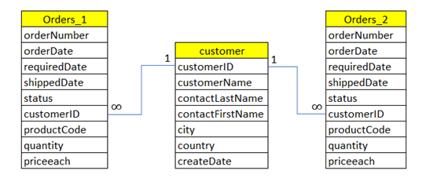
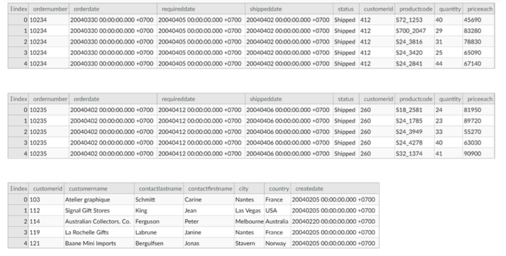
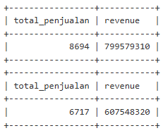
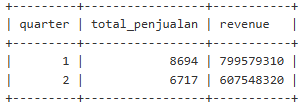
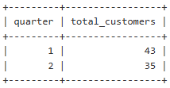
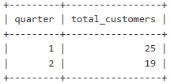
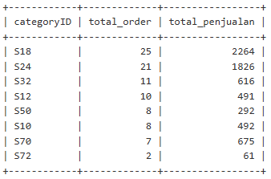
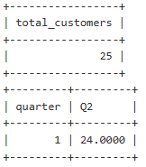

# 📊 Project Data Analysis for B2B Retail: Customer Analytics Report

## 📖 Latar Belakang
xyz.com adalah perusahan rintisan B2B yang menjual berbagai produk tidak langsung kepada end user tetapi ke bisnis/perusahaan lainnya. Sebagai data-driven company, maka setiap pengambilan keputusan di xyz.com selalu berdasarkan data. Setiap quarter xyz.com akan mengadakan townhall dimana seluruh atau perwakilan divisi akan berkumpul untuk me-review performance perusahaan selama quarter terakhir.

## 🎯 Tugas
- Bagaimana pertumbuhan penjualan saat ini?
- Apakah jumlah customers xyz.com semakin bertambah ?
- Dan seberapa banyak customers tersebut yang sudah melakukan transaksi?
- Category produk apa saja yang paling banyak dibeli oleh customers?
- Seberapa banyak customers yang tetap aktif bertransaksi?

## 🛠 Langkah-langkah
1. Menggunakan klausa “Select … From …” untuk mengambil data di database
2. Menggunakan klausa Where dan Operator untuk menfilter data
3. Menggunakan “group by”dan fungsi aggregat untuk aggregasi penjualan dan revenue
4. Menggunakan “order by” untuk mengurutkan data
5. Menggunakan “union” untuk menggabungkan tabel data penjualan
6. Menggunakan “date and time function” dan fungsi text untuk data manipulation
7. Menggunakan subquery untuk menyimpan hasil sementara untuk digunakan kembali dalam query.

## Tabel yang digunakan

1. Tabel orders_1 : Berisi data terkait transaksi penjualan periode quarter 1 (Jan – Mar 2004)
2. Tabel Orders_2 : Berisi data terkait transaksi penjualan periode quarter 2 (Apr – Jun 2004)
3. Tabel Customer : Berisi data profil customer yang mendaftar menjadi customer xyz.com

## Memahami tabel
- Mengecek tabel orders_1 :SELECT * FROM orders_1 limit 5;
  ```sql
  SELECT* FROM orders_1
  limit 5;
- Mengecek tabel orders_2 :SELECT * FROM orders_2 limit 5;
  ```sql
  SELECT* FROM orders_2
  limit 5;
- Mengecek tabel customer :SELECT * FROM customer limit 5;
  ```sql
  SELECT* FROM customer
  limit 5;



## Mengetahui total penjualan dan revenue pada quarter-1 (Jan, Feb, Mar) dan quarter-2 (Apr,Mei,Jun)
- Dari tabel orders_1 lakukan penjumlahan pada kolom quantity dengan fungsi aggregate sum() dan beri nama “total_penjualan”, kalikan kolom quantity dengan kolom priceEach kemudian jumlahkan hasil perkalian kedua kolom tersebut dan beri nama “revenue”
- Perusahaan hanya ingin menghitung penjualan dari produk yang terkirim saja, jadi kita perlu mem-filter kolom ‘status’ sehingga hanya menampilkan order dengan status “Shipped”.
- Lakukan Langkah 1 & 2, untuk tabel orders_2.
  ```sql
  SELECT SUM(quantity) AS total_penjualan, SUM(quantity*priceeach) AS revenue FROM orders_1
  WHERE status='Shipped';
  
  SELECT SUM(quantity) AS total_penjualan, SUM(quantity*priceeach) AS revenue FROM orders_2
  WHERE status='Shipped';



## Menghitung persentasi keseluruhan penjualan
- Pilihlah kolom “orderNumber”, “status”, “quantity”, “priceEach” pada tabel orders_1, dan tambahkan kolom baru dengan nama “quarter” dan isi dengan value “1”. Lakukan yang sama dengan tabel orders_2, dan isi dengan value “2”, kemudian gabungkan kedua tabel tersebut.
- Gunakan statement dari Langkah 1 sebagai subquery dan beri alias “tabel_a”.
- Dari “tabel_a”, lakukan penjumlahan pada kolom “quantity” dengan fungsi aggregate sum() dan beri nama “total_penjualan”, dan kalikan kolom quantity dengan kolom priceEach kemudian jumlahkan hasil perkalian kedua kolom tersebut dan beri nama “revenue”.
- Filter kolom ‘status’ sehingga hanya menampilkan order dengan status “Shipped”.
Kelompokkan total_penjualan berdasarkan kolom “quarter”, dan jangan lupa menambahkan kolom ini pada bagian select.
  ```sql
  SELECT 
      quarter,
      SUM(quantity) AS total_penjualan,
      SUM(quantity * priceEach) AS revenue
  FROM (
      SELECT orderNumber, status, quantity, priceEach, 1 AS quarter
      FROM orders_1
      UNION ALL
      SELECT orderNumber, status, quantity, priceEach, 2 AS quarter
      FROM orders_2
  ) AS tabel_a
  WHERE status = 'Shipped'
  GROUP BY quarter
  ORDER BY quarter;
  


## Perhitungan growth penjualan dan revenue
%Growth Penjualan = (6717 – 8694)/8694 = -22%

%Growth Revenue = (607548320 – 799579310)/ 799579310 = -24%

## Mengetahui apakah jumlah customers xyz.com semakin bertambah
- Dari tabel customer, pilihlah kolom customerID, createDate dan tambahkan kolom baru dengan menggunakan fungsi QUARTER(…) untuk mengekstrak nilai quarter dari CreateDate dan beri nama “quarter”
- Filter kolom “createDate” sehingga hanya menampilkan baris dengan createDate antara 1 Januari 2004 dan 30Juni 2004
- Gunakan statement Langkah 1 & 2 sebagai subquery dengan alias tabel_b
- Hitunglah jumlah unik customers à tidak ada duplikasi customers dan beri nama “total_customers”
- Kelompokkan total_customer berdasarkan kolom “quarter”, dan jangan lupa menambahkan kolom ini pada bagian select.
  ```sql
  SELECT 
    quarter,
    COUNT(DISTINCT customerID) AS total_customers
  FROM (
      SELECT 
          customerID,
          createDate,
          QUARTER(createDate) AS quarter
      FROM customer
      WHERE createDate BETWEEN '2004-01-01' AND '2004-06-30'
  ) AS tabel_b
  GROUP BY quarter
  ORDER BY quarter;



## Mengetahui seberapa banyak customers tersebut yang sudah melakukan transaksi
- Dari tabel customer, pilihlah kolom customerID, createDate dan tambahkan kolom baru dengan menggunakan fungsi QUARTER(…) untuk mengekstrak nilai quarter dari CreateDate dan beri nama “quarter”
- Filter kolom “createDate” sehingga hanya menampilkan baris dengan createDate antara 1 Januari 2004 dan 30 Juni 2004
- Gunakan statement Langkah A&B sebagai subquery dengan alias tabel_b
- Dari tabel orders_1 dan orders_2, pilihlah kolom customerID, gunakan DISTINCT untuk menghilangkan duplikasi, kemudian gabungkan dengan kedua tabel tersebut dengan UNION.
- Filter tabel_b dengan operator IN() menggunakan 'Select statement langkah 4' , sehingga hanya customerID yang pernah bertransaksi (customerID tercatat di tabel orders) yang diperhitungkan.
- Hitunglah jumlah unik customers (tidak ada duplikasi customers) di statement SELECT dan beri nama “total_customers”
- Kelompokkan total_customer berdasarkan kolom “quarter”, dan jangan lupa menambahkan kolom ini pada bagian select.

  ```sql
  SELECT 
    quarter,
    COUNT(DISTINCT customerID) AS total_customers
  FROM (
      SELECT 
          customerID,
          QUARTER(createDate) AS quarter
      FROM customer
      WHERE createDate BETWEEN '2004-01-01' AND '2004-06-30'
  ) AS tabel_b
  WHERE customerID IN (
      SELECT DISTINCT customerID FROM orders_1
      UNION
      SELECT DISTINCT customerID FROM orders_2
  )
  GROUP BY quarter
  ORDER BY quarter;



## Mengetahui category produk apa saja yang paling banyak di-order oleh customers di Quarter-2
- Dari kolom orders_2, pilih productCode, orderNumber, quantity, status
- Tambahkan kolom baru dengan mengekstrak 3 karakter awal dari productCode yang merupakan ID untuk kategori produk; dan beri nama categoryID
- Filter kolom “status” sehingga hanya produk dengan status “Shipped” yang diperhitungkan
- Gunakan statement Langkah 1, 2, dan 3 sebagai subquery dengan alias tabel_c
- Hitunglah total order dari kolom “orderNumber” dan beri nama “total_order”, dan jumlah penjualan dari kolom “quantity” dan beri nama “total_penjualan”
- Kelompokkan berdasarkan categoryID, dan jangan lupa menambahkan kolom ini pada bagian select.
- Urutkan berdasarkan “total_order” dari terbesar ke terkecil
  ```sql
  SELECT 
    LEFT(productCode, 3) AS categoryID,
    COUNT(DISTINCT orderNumber) AS total_order,
    SUM(quantity) AS total_penjualan
  FROM (
      SELECT 
          productCode,
          orderNumber,
          quantity,
          status,
          LEFT(productCode, 3) AS categoryID
      FROM orders_2
      WHERE status = 'Shipped'
  ) AS tabel_c
  GROUP BY LEFT(productCode, 3)
  ORDER BY total_order DESC;



## Mengetahui seberapa banyak customers yang tetap aktif bertransaksi setelah transaksi pertamanya
- Dari tabel orders_1, tambahkan kolom baru dengan value “1” dan beri nama “quarter”
- Dari tabel orders_2, pilihlah kolom customerID, gunakan distinct untuk menghilangkan duplikasi
- Filter tabel orders_1 dengan operator IN() menggunakan 'Select statement langkah 2', sehingga hanya customerID yang pernah bertransaksi di quarter 2 (customerID tercatat di tabel orders_2) yang diperhitungkan.
- Hitunglah jumlah unik customers (tidak ada duplikasi customers) dibagi dengan total_ customers dalam percentage, pada Select statement dan beri nama “Q2”
  ```sql
  #Menghitung total unik customers yang transaksi di quarter_1
  SELECT COUNT(DISTINCT customerID) as total_customers FROM orders_1;
  #output = 25
  
  SELECT
      1 AS quarter,  
      (COUNT(DISTINCT customerID) * 100) / 25 AS Q2  
  FROM orders_1
  WHERE customerID IN (
      SELECT DISTINCT customerID
      FROM orders_2
  );


## Kesimpulan
1. Performance xyz.com menurun signifikan di quarter ke-2, terlihat dari nilai penjualan dan revenue yang drop hingga 22% dan 24%,
2. perolehan customer baru juga tidak terlalu baik, dan sedikit menurun dibandingkan quarter sebelumnya.
3. Ketertarikan customer baru untuk berbelanja di xyz.com masih kurang, hanya sekitar 56% saja yang sudah bertransaksi. Disarankan tim Produk untuk perlu mempelajari behaviour customer dan melakukan product improvement, sehingga conversion rate (register to transaction) dapat meningkat.
4. Produk kategori S18 dan S24 berkontribusi sekitar 50% dari total order dan 60% dari total penjualan, sehingga xyz.com sebaiknya fokus untuk pengembangan category S18 dan S24.
5. Retention rate customer xyz.com juga sangat rendah yaitu hanya 24%, artinya banyak customer yang sudah bertransaksi di quarter-1 tidak kembali melakukan order di quarter ke-2 (no repeat order).
6. xyz.com mengalami pertumbuhan negatif di quarter ke-2 dan perlu melakukan banyak improvement baik itu di sisi produk dan bisnis marketing, jika ingin mencapai target dan positif growth di quarter ke-3. Rendahnya retention rate dan conversion rate bisa menjadi diagnosa awal bahwa customer tidak tertarik/kurang puas/kecewa berbelanja di xyz.com.
